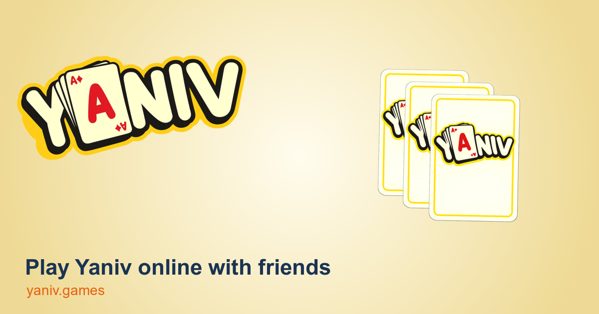

# Yaniv



Multiplayer Hebrew Yaniv card game built with a React frontend and a Cloudflare Workers backend. Game state is server-authoritative and runs inside a Durable Object, with clients sending intents over WebSockets.

## Live project

- Frontend: [yaniv.games](https://yaniv.games)
- Backend: [yaniv-backend.buzagloidan.workers.dev](https://yaniv-backend.buzagloidan.workers.dev)

## Stack

- Frontend: React, TypeScript, Vite, Tailwind CSS v4, Framer Motion, Zustand
- Backend: Cloudflare Workers, Hono, Durable Objects
- Data: Cloudflare D1 for lobby metadata, KV for sessions
- Realtime: WebSockets with a server-authoritative state machine

## Repository layout

```text
yaniv-frontend/   React client, RTL Hebrew UI, assets, sounds
yaniv-backend/    Worker, Durable Object game engine, D1 queries, tests
shared/           Shared game protocol and types
```

## Local development

1. Install dependencies:

   ```bash
   cd yaniv-backend && npm ci
   cd ../yaniv-frontend && npm ci
   ```

2. Provision your own Cloudflare resources for a forked deployment.
   Use [yaniv-backend/wrangler.example.toml](yaniv-backend/wrangler.example.toml) as the template for your own D1, KV, Durable Object, and Analytics bindings.

3. Initialize the backend schema in your local D1 database:

   ```bash
   cd yaniv-backend
   npx wrangler d1 execute <your-database-name> --local --file src/db/schema.sql
   ```

4. Start the backend:

   ```bash
   cd yaniv-backend
   npm run dev
   ```

5. Start the frontend in another terminal:

   ```bash
   cd yaniv-frontend
   cp .env.example .env.local
   npm run dev
   ```

By default, the frontend uses the Vite proxy for `/auth`, `/tables`, and `/game`, so `VITE_API_URL` can stay empty for local development.

## Scripts

- Backend: `npm run dev`, `npm test`, `npm run deploy`
- Frontend: `npm run dev`, `npm run build`, `npm run lint`

## Architecture notes

- The Durable Object is the source of truth for active games.
- State transitions live in `yaniv-backend/src/durable-objects/stateMachine.ts`.
- D1 stores users, tables, and match history, not live game state.
- Shared protocol types live in [shared/protocol.ts](shared/protocol.ts).

## Open-source notes

- Forks should create their own Cloudflare resources and deployment settings.
- The current frontend and backend include production branding and URLs for the live game.
- The current web client uses guest nickname sessions via `/auth/dev`.

## Contributing

See [CONTRIBUTING.md](CONTRIBUTING.md).

## Security

See [SECURITY.md](SECURITY.md).

## License

[MIT](LICENSE)
